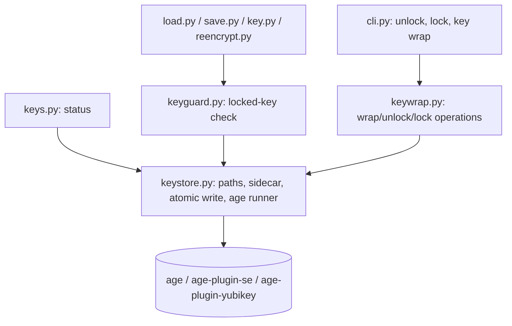
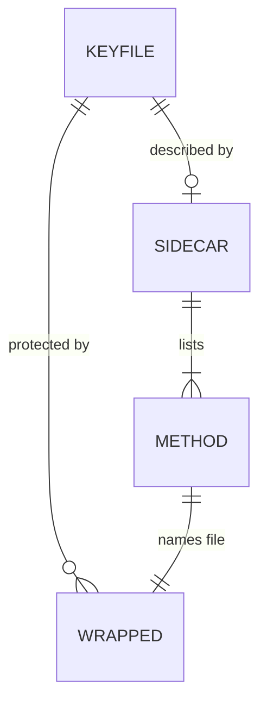

<!-- CLASI: Before changing code or making plans, review the SE process in CLAUDE.md -->

# Sprint 004: Age key lock/unlock (wrapped at rest)

## Goals

Protect the age key file at rest. Add `dotconfig unlock`, `dotconfig lock`
and `dotconfig key wrap` so the key exists only wrapped (encrypted) on disk
and is restored to `$SOPS_AGE_KEY_FILE` only for a work session, after a
human proves presence with one method.

## Problem

The age key that decrypts every dotconfig store sits on disk in the clear
(`~/.config/sops/age/keys.txt`) and ends up in backups. A stolen Mac, leaked
disk image or Time Machine backup exposes every secret in every repo. There
is also no way for an audit job to wipe the usable key without losing it.

## Solution

Wrapped copies live next to the key as `<keyfile>.<method>.age` (one file per
method: se, yubikey, identity/recovery, passphrase), described by a
secret-free sidecar `<keyfile>.lock.yaml`. `key wrap` creates and verifies
wrapped files; `unlock` decrypts to memory, checks the public key and writes
the plain key atomically (0600); `lock` deletes the plain key only when a
verified wrapped copy exists. Uses `age` and its plugins; no custom crypto.
The key is unchanged and no store is re-encrypted. Other commands detect a
locked key before calling sops and report `age key is locked — run:
dotconfig unlock` with a distinct exit code.

## Success Criteria

- Never locked out: `lock`/`wrap` cannot leave zero working copies; every
  unlock checks the public key.
- `unlock` requires a present human (no non-interactive secret input);
  `lock` is safe to run unattended.
- Works over SSH with no GUI (passphrase method).
- Key status reports locked/unlocked, wrapped methods, last-verified dates,
  and warns when `SOPS_AGE_KEY` is set.
- `load`, `save`, `key load`, `reencrypt` etc. give the locked-key message
  instead of sops' "no identity found".
- Docs stop recommending `SOPS_AGE_KEY` and document manual `age -d` for each
  wrapped file.
- Tests never touch the real key (temp `SOPS_AGE_KEY_FILE`, test identities).

## Scope

### In Scope

- `dotconfig key wrap` (setup and add-method; round-trip verification).
- `dotconfig unlock [--with METHOD] [--identity FILE] [--paste]`.
- `dotconfig lock` (with `--force`).
- Sidecar metadata file and per-method wrapped-file naming.
- Extending `keys.py` status: locked state, methods, verified dates,
  `SOPS_AGE_KEY` warning.
- Locked-key detection and messaging in other commands; optional inline
  unlock on a TTY.
- Documentation updates; resolution of the issue's open questions
  (file-per-method, default method order, launchd lock hook, sidecar name)
  during detail planning.

### Out of Scope

- Wiping `.env` and `config/files/` across repos (the nightly cleanup; it
  will call `dotconfig lock` but is its own feature).
- Re-encrypting every repo to new recipients.
- Moving secrets out of `~/.zshenv` into a personal dotconfig store.
- Keeping the unlocked key on a RAM disk (`unlock` only creates the key
  directory if missing).

## Test Strategy

Unit and integration tests with a temp `SOPS_AGE_KEY_FILE` and throwaway age
identities; plain age keys stand in for plugins; passphrase flows via an
expect-style TTY harness. Cover lock refusal without a verified wrapped file,
public-key mismatch, atomic 0600 write, locked-key detection in other
commands, and status output. Nothing touches the real key.

## Decisions for stakeholder review

The issue's four open questions were resolved using the issue's own
proposals. Override any of these during review.

1. **Wrapped-file layout**: one wrapped file per method,
   `<keyfile>.<method>.age` (not one multi-recipient file plus a passphrase
   file). A method can be added or removed without touching the others.
2. **`unlock` default order**: Secure Enclave (only in a GUI session) ->
   YubiKey (only if `age-plugin-yubikey` and a device are present) ->
   passphrase. A GUI session does not auto-pick the passphrase file unless
   the earlier methods are unavailable or fail. `--with METHOD` overrides.
   On failure the remaining methods are listed.
3. **Automatic lock**: `lock` runs by hand or from external jobs
   (cron/launchd/audit) only this sprint. No launchd screen-lock/sleep hook.
   Possible follow-up sprint.
4. **Sidecar**: `<keyfile>.lock.yaml`, in the YAML format shown in the issue
   (`public_key`, `methods[]` with `file`, `kind`, `recipient`, `label`,
   `verified`, `hint`).

Additional planner choices (also overridable):

- A distinct exit code for "key is locked" is **75**; ordinary failures stay 1.
  Exit 0 means success or already-in-desired-state.
- `lock` overwrite is best-effort (zero-fill then unlink) and documented as
  not guaranteed on APFS/SSD.
- Plugin methods (`se`, `yubikey`) shell out to `age`/`age-plugin-*` via a
  single subprocess helper so tests can substitute plain age identities for
  plugins. The passphrase path lets `age` prompt on the TTY; tests exercise
  it through a pty harness.
- The existing `dotconfig keys` status command currently prints
  `export SOPS_AGE_KEY=...` guidance and Codespaces secret instructions that
  embed the secret. Those recommendations are removed/reworded to match
  requirement 8 (ticket 005). Stakeholder should confirm that dropping the
  Codespaces `SOPS_AGE_KEY` guidance (and `gh-push --include-age-key`, which
  is left unchanged) is acceptable.

## Architecture

**Sizing: Substantial.** This sprint adds a new subsystem (key lifecycle
wrap/lock/unlock) with a new on-disk metadata format, new CLI commands, and a
new cross-module dependency: `load`, `save`, `key` and `reencrypt` start
depending on a shared locked-key guard. A full-size write-up is warranted.

### Architecture Overview

Dependency direction: CLI and command modules -> operations -> store ->
external `age`. `keystore` has no dependency on any other dotconfig module
except `output`. `keyguard` depends only on `keystore`, so `load`/`save`
can import it without a cycle (they must not import `keywrap`).

Modules (new):

- **keystore.py** -- "Owns the on-disk layout of the plain key file, wrapped
  files and sidecar, and all calls to the age binaries." Inside: key-path
  resolution (`SOPS_AGE_KEY_FILE`, default `~/.config/sops/age/keys.txt`),
  derived wrapped-file names, sidecar read/write (YAML, atomic), atomic 0600
  write of the plain key, directory permission check, public-key derivation,
  a thin age runner (encrypt to recipient / passphrase, decrypt with identity
  or plugin). Outside: any user interaction or policy. Serves SUC-001..005.
- **keywrap.py** -- "Implements the wrap, unlock and lock operations and their
  safety rules." Inside: round-trip verification, never-replace-with-unverified,
  unlock method selection/order, public-key match check, lock refusal rules,
  `--force`. Outside: file format and subprocess details (keystore), CLI
  parsing. Serves SUC-001..003.
- **keyguard.py** -- "Answers whether the age key is locked and raises the
  standard locked-key error." Inside: locked = plain file missing AND at least
  one wrapped file/sidecar present (and no `SOPS_AGE_KEY` set); the message,
  exit code 75, optional inline unlock offer on a TTY. Serves SUC-004, SUC-006.

Modules (changed): `keys.py` (status: locked/unlocked, methods, verified
dates, `SOPS_AGE_KEY` warning, no longer recommends `SOPS_AGE_KEY`),
`cli.py` (new `unlock`, `lock`, `key wrap` commands; thin), and `load.py`,
`save.py`, `key.py` (`load_key`/`get_key` paths that call sops), `reencrypt.py`
(call the guard before the first sops invocation).

### Data Model

The sidecar `<keyfile>.lock.yaml` is the only new persisted format. It holds
no secrets: `public_key`, and per method `file`, `kind` (se | yubikey |
identity | passphrase), `recipient` (absent for passphrase), `label`,
`verified`, optional `hint`. Wrapped files are standard age output and open
with `age -d` alone, so losing the sidecar does not lose the key.

### Design Rationale

- **Decision: one file per method.** Alternatives: one multi-recipient file.
  Why: independent add/remove; unlock knows which method a file needs;
  a failed verification can delete exactly one file. Consequence: N files
  next to the key.
- **Decision: guard in a separate module, not inside keystore.** Alternatives:
  duplicate checks in each command; put into `load.py`. Why: `save.py` and
  `load.py` already import each other's helpers; a leaf module avoids cycles
  and shotgun-surgery of messaging.
- **Decision: decrypt to memory, then atomic rename.** Plain key is written
  only to `$SOPS_AGE_KEY_FILE`, via a temp file in the same directory (0600)
  and `os.replace`. No stdout, logs or env vars.
- **Decision: no secret inputs to `unlock`** beyond the TTY (no passphrase
  flag/env var; `--paste` requires a real TTY and uses no-echo input).
- **Decision: `lock` never prompts.** It refuses unless a verified wrapped
  file exists whose method is in the sidecar and the sidecar `public_key`
  equals the plain key's public key.

### Impact on Existing Components

`load`, `save`, `key`, `reencrypt`: add one guard call at entry of the
operations that invoke sops (additive; no behavior change when unlocked).
`keys.py`: output changes (extra status lines; export suggestions removed).
`init.py` key helpers are reused, not changed.

### Self-Review (architecture_review gate)

- Consistency: Overview, modules and data model agree; decisions recorded.
- Codebase alignment: `keys.py` already resolves the key path and derives the
  public key via `age-keygen -y`; `init._read_key_from_file` is reused.
  `_decrypt_sops`/`_encrypt_sops` swallow sops errors into warnings and return
  None/False, so the guard must run **before** them (hence call-site guards,
  not error-text sniffing). `save.py` sets `SOPS_AGE_KEY_FILE` from `.env`
  (setdefault), which `keystore` path resolution honors automatically.
- Design quality: each module passes the one-sentence cohesion test; no cycles
  (`keyguard` -> `keystore` only); fan-out <= 3. cli stays thin.
- Anti-patterns: possible shotgun surgery for the guard is contained by a
  single `require_unlocked()` entry point. No god module (policy vs. format
  vs. guard are split).
- Risks: (a) lock-out -- mitigated by verify-before-record and lock refusal
  rules, tested; (b) secure-delete on APFS is best-effort; (c) plugin behavior
  cannot be tested in CI, so plugins are only exercised behind the age-runner
  seam with plain identities -- a manual smoke test against real plugins is
  advised before release; (d) `SOPS_AGE_KEY` set in the environment makes sops
  work while "locked" -- guard treats that as unlocked but status warns.
- Verdict: **APPROVE.**

### Migration Concerns

None for stores (no re-encryption). Existing users with a plain key and no
sidecar see no change: "not wrapped" is not "locked", and `lock` refuses
until `key wrap` has been run. Existing `keys` output changes (see decisions).

### Open Questions

None blocking; see "Decisions for stakeholder review".

## Use Cases

### SUC-001: Wrap the key with one or more methods
Parent: (new)

- **Actor**: Key owner
- **Preconditions**: Plain key exists at `$SOPS_AGE_KEY_FILE`; `age` installed
- **Main Flow**:
  1. Owner runs `dotconfig key wrap` with `--se`, `--recipient ... --label ...`,
     `--yubikey` and/or `--passphrase`.
  2. Each wrapped file is written, then opened via a human-present round trip.
  3. Public key of the result is compared to the original; sidecar updated
     with `verified:`.
- **Postconditions**: Verified wrapped files and sidecar exist; plain key untouched
- **Acceptance Criteria**:
  - [ ] Failed verification deletes only the new file and exits non-zero
  - [ ] An existing working wrapped file is never replaced by an unverified one
  - [ ] Missing plugin reports the install command

### SUC-002: Unlock the key for a session
Parent: (new)

- **Actor**: Key owner (present)
- **Preconditions**: Key is locked; sidecar and at least one wrapped file exist
- **Main Flow**:
  1. Owner runs `dotconfig unlock` (optionally `--with`, `--identity`, `--paste`).
  2. Method chosen by default order; key decrypted to memory.
  3. Public key checked against sidecar; plain file written atomically (0600).
- **Postconditions**: Plain key at `$SOPS_AGE_KEY_FILE`
- **Acceptance Criteria**:
  - [ ] Already unlocked and matching: message, exit 0
  - [ ] Public-key mismatch writes nothing and exits non-zero
  - [ ] No non-interactive secret input exists; `--paste` requires a TTY
  - [ ] Works with no GUI via passphrase

### SUC-003: Lock the key (attended or unattended)
Parent: (new)

- **Actor**: Key owner, or an unattended job
- **Preconditions**: Plain key present
- **Main Flow**:
  1. `dotconfig lock` verifies a wrapped file + sidecar entry + matching public key.
  2. Plain key overwritten best-effort and unlinked.
- **Postconditions**: Only wrapped copies remain
- **Acceptance Criteria**:
  - [ ] Refuses without a verified wrapped copy; `--force` prints what is lost
  - [ ] Already locked exits 0; no prompts

### SUC-004: See key status
Parent: (new)

- **Actor**: Key owner
- **Main Flow**: Run the key status command; see locked/unlocked, methods,
  last-verified dates, and a warning if `SOPS_AGE_KEY` is set.
- **Acceptance Criteria**:
  - [ ] Output covers all of the above; no secret printed

### SUC-005: Recover without the sidecar
Parent: (new)

- **Actor**: Key owner
- **Main Flow**: Sidecar lost; owner runs manual `age -d` documented for each method.
- **Acceptance Criteria**:
  - [ ] Wrapped files decrypt with plain `age` (tested); docs list commands

### SUC-006: Commands fail clearly when locked
Parent: (new)

- **Actor**: Owner, script or agent
- **Main Flow**: `load`/`save`/`key load`/`reencrypt` run while locked.
- **Acceptance Criteria**:
  - [ ] Message `age key is locked — run: dotconfig unlock`, exit code 75, sops not invoked
  - [ ] On a TTY, offers inline unlock; non-TTY fails with message and code

## GitHub Issues

(GitHub issues linked to this sprint's tickets. Format: `owner/repo#N`.)

## Definition of Ready

Before tickets can be created, all of the following must be true:

- [ ] Sprint planning document is complete (sprint.md, including its
      Architecture and Use Cases sections)
- [ ] Architecture review passed (or skipped, for changes with no
      architectural impact)
- [ ] Stakeholder has approved the sprint plan

## Tickets

| # | Title | Depends On |
|---|-------|------------|
| 001 | keystore module: key paths, sidecar, atomic write, age runner | - |
| 002 | dotconfig key wrap with round-trip verification | 001 |
| 003 | dotconfig unlock | 001, 002 |
| 004 | dotconfig lock | 001, 002 |
| 005 | Key status: lock state, methods, SOPS_AGE_KEY warning | 001 |
| 006 | Locked-key guard in load, save, key load, reencrypt | 001, 003 |
| 007 | Documentation: lock/unlock, manual age -d recovery, stop recommending SOPS_AGE_KEY | 003, 004, 005, 006 |

Tickets execute serially in the order listed.
