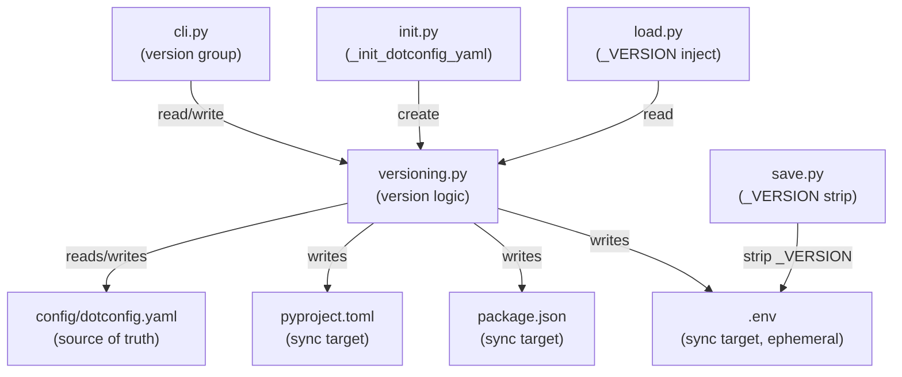
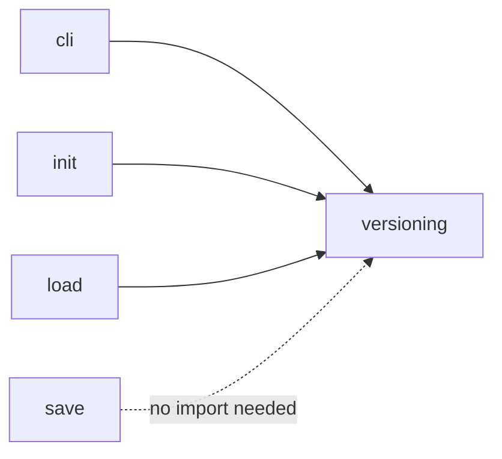

<!-- CLASI: Before changing code or making plans, review the SE process in CLAUDE.md -->

# Architecture Update -- Sprint 003: dotconfig version command and dotconfig.yaml source-of-truth

## What Changed

### New Module: `src/dotconfig/versioning.py`

A self-contained versioning module ported from the CLASI reference
implementation (`clasi/versioning.py`). Adaptations from the reference:

- **Source of truth is fixed**: `config/dotconfig.yaml` (key `version`).
  CLASI auto-detects a source file from `_VERSION_FILES`; dotconfig does not.
- **New helpers**: `read_dotconfig_version(config_dir)`,
  `write_dotconfig_version(config_dir, version)`,
  `load_dotconfig_yaml(config_dir) -> dict | None`,
  `update_dotenv_version(version, env_path)`.
- **Sync targets**: `pyproject.toml`, `package.json`, `.env` (in that order).
  `.env` is written via `update_dotenv_version` (rewrite/insert `_VERSION=`
  at top, preserve remaining content). `pyproject.toml` and `package.json`
  are written by the ported `update_pyproject_version` /
  `update_package_json_version` helpers.
- **Dropped CLASI-specifics**: `should_version()`, `load_version_trigger()`,
  `VALID_TRIGGERS`, `DEFAULT_TRIGGER`, `load_version_source()`.
- **Kept verbatim**: `parse_format`, `_classify_token`, `format_has_auto`,
  `_format_segment`, `build_version`, `build_tag_regex`,
  `compute_next_version`, `_get_existing_tags`, `create_version_tag`.
- **`bump_version(major, tag, project_root, config_dir)`** returns
  `{version, source, synced, tag}`. Sync targets are written best-effort;
  missing files are silently skipped.

Module boundary: all version-file I/O, git-tag I/O, and format computation
live here. Nothing outside this module writes to `config/dotconfig.yaml`
for versioning purposes.

### Modified: `src/dotconfig/init.py`

- New private helper `_init_dotconfig_yaml(config_dir, project_root, quiet)`.
  - Idempotent: does nothing if `config/dotconfig.yaml` already exists.
  - Seeds `version` from `package.json` > `pyproject.toml` > `"0.0.0"`.
  - Writes a minimal YAML file with an explanatory comment.
- `init_config()` calls `_init_dotconfig_yaml` between `_init_env_files` and
  `_write_agents_md`, under a `heading("📌 Project metadata:")` block.
- New import: `from dotconfig.versioning import load_dotconfig_yaml` (for
  reading existing version files during seed detection).

### Modified: `src/dotconfig/cli.py`

- New `version` command group (top-level, modelled on the `key` group).
  Invoked without subcommand: prints current version from
  `config/dotconfig.yaml`; exits 1 if absent.
- New `version bump` subcommand with `--major INT`, `--tag`, `-p/--push` options.
  Delegates all logic to `bump_version()` in `versioning.py`.
- New imports: `read_dotconfig_version`, `bump_version` from `versioning`.

### Modified: `src/dotconfig/load.py`

- In the classic `.env` output path (after `_build_metadata_header`), reads
  `config/dotconfig.yaml` via `load_dotconfig_yaml`. If a `version` field is
  present, inserts `_VERSION=<version>` as the first content line after the
  metadata header block.
- Only the classic `.env` path is affected. The structured (`--json`/`--yaml`)
  and split output paths are untouched.
- New import: `load_dotconfig_yaml` from `versioning`.

### Modified: `src/dotconfig/save.py`

- `_parse_env_layers`: in the section-content accumulation branch (the
  `elif current_section is not None:` block), any line matching `^_VERSION=`
  is silently dropped before appending to `current_lines`.
- No additional filter is needed for pre-section content. The `_VERSION=`
  line is injected by `load.py` before the first `#@dotconfig:` section
  marker. In `_parse_env_layers`, lines that appear before the first section
  marker (and are not metadata keys) are silently discarded — they are
  accumulated into neither `sections` nor metadata. So `_VERSION=` is
  naturally ignored in the pre-section region without any extra logic.
- The structured (`--json`/`--yaml`) save path (`_save_config_structured`)
  parses JSON/YAML, not `.env` sections, and is entirely unaffected.
- No new imports required (`re` is already imported in `save.py`).

### New File: `config/dotconfig.yaml` (per project, generated at init)

```yaml
# dotconfig project metadata.
# Edit `version` only via `dotconfig version bump`.
version: <seeded-value>
```

Optional fields (documented as comments, not written by default):
- `version_format: X+.YYYYMMDD.R+`
- `version_sync: [extra/paths]`

## Why

The dotconfig project has no first-class mechanism for users to manage their
project version across multiple version files (`pyproject.toml`,
`package.json`) or to expose it in the materialised `.env`. The CLASI
versioning scheme is already documented and battle-tested; porting it avoids
reinventing the format engine while adapting the source-of-truth model to
dotconfig's layout (`config/dotconfig.yaml` rather than CLASI's
`docs/clasi/settings.yaml`). Moving the version source of truth to
`config/dotconfig.yaml` gives a stable, tool-independent file that can hold
future dotconfig project-level settings.

Addresses use cases SUC-001 through SUC-006.

## Diagrams

### Component diagram



### Dependency graph



`save.py` does not import `versioning.py`; it applies a simple regex filter
inline. All other callers import `versioning` directly. No circular
dependencies.

## Impact on Existing Components

- **`cli.py`**: New top-level `version` group added. No existing commands are
  changed. One new import from `versioning`.
- **`init.py`**: `init_config` gains one new step. Existing steps, their order,
  and their outputs are unchanged. One new import.
- **`load.py`**: Classic `.env` output gains one new line (`_VERSION=…`)
  immediately after the metadata header. Existing section structure and all
  other output paths are unaffected. One new import.
- **`save.py`**: `_parse_env_layers` and the flat save path now silently drop
  `_VERSION=` lines. All other lines are parsed identically to before.
- **No new external dependencies**: `pyyaml` is already in `requirements`.
  `re`, `subprocess`, `pathlib` are stdlib.
- **`config/dotconfig.yaml`**: New file created by `dotconfig init`. Existing
  dotconfig projects that run `dotconfig init` again will have this file
  created for the first time; this is additive and safe.

## Migration Concerns

- **Existing `.env` files**: do not contain `_VERSION=`. After upgrading and
  running `dotconfig load`, new `.env` files will include `_VERSION=`. This is
  additive; no existing tooling should break unless scripts grep for exact
  line counts. `dotconfig save` strips the line, so existing config files are
  safe.
- **Existing dotconfig projects without `dotconfig.yaml`**: `dotconfig load`
  reads `load_dotconfig_yaml(config_dir)` and skips injection if the file is
  absent or has no `version` key. No breakage.
- **`dotconfig version`** will exit 1 if `config/dotconfig.yaml` does not
  exist — which is expected for projects that haven't run `dotconfig init`
  since the upgrade. The error message directs the user to run `dotconfig init`.
- **No changes to `pyproject.toml` or `package.json` format**: the sync writes
  use the same regex/JSON update logic ported from CLASI.

## Design Rationale

### Why `config/dotconfig.yaml` as source of truth (not `pyproject.toml`)

**Context**: CLASI uses whichever of `pyproject.toml`/`package.json` exists.
For dotconfig, both may exist in the same project (Python package with a
frontend), and neither is "more authoritative" from dotconfig's perspective.

**Decision**: Fix the source of truth at `config/dotconfig.yaml`.

**Alternatives considered**:
- Keep `pyproject.toml` as primary with `package.json` as sync target (CLASI
  approach). Rejected: breaks symmetry when both exist; the user must know
  which wins.
- Auto-detect priority (CLASI's `load_version_source`). Rejected: introduces
  implicit magic that confuses debugging.

**Why this choice**: One fixed file is unambiguous. `config/` is already the
dotconfig working directory; co-locating project metadata there is consistent.

**Consequences**: Projects must run `dotconfig init` before `dotconfig version`
is usable. This is acceptable — `init` is already the entry point.

### Why `update_dotenv_version` writes `.env` as a sync target

**Context**: The materialised `.env` is gitignored and ephemeral — `load`
regenerates it from source. But `bump` can write it so the active session
immediately sees the new version without re-running `load`.

**Decision**: Include `.env` as a sync target in `bump`, using a
rewrite-at-top approach.

**Consequences**: If `.env` does not exist (first run, or after `rm .env`),
the sync step is silently skipped. `load` will inject `_VERSION` the next
time it runs.

## Sprint 003 Addendum (post-execution, ticket 007)

### Modified: `src/dotconfig/versioning.py` (additional helper)

- New public helper `seed_version_from_sources(project_root: Path) -> str | None`.
  Reads `package.json` version first, then `pyproject.toml [project] version`,
  returning the first found value or `None` if neither file contains a version.
  Both `_init_dotconfig_yaml` (in `init.py`) and the new `version load` CLI
  subcommand delegate to this helper; the duplicate inline parsing code in
  `_init_dotconfig_yaml` is removed.

### Modified: `src/dotconfig/cli.py` (new subcommand)

- New `version load` subcommand under the existing `version` group.
  Calls `seed_version_from_sources`, writes the result via
  `write_dotconfig_version`, prints the loaded version. Exits 1 with a
  friendly message if neither source file exists.

These additions are consistent with the existing dependency graph
(`cli.py -> versioning`, `init.py -> versioning`). No new edges added.

## Open Questions

- Should `version bump --push` also push the branch commits (not just tags)?
  Current design mirrors CLASI: only `git push --tags`. The branch push is
  the caller's responsibility. This matches the TODO spec. No action needed
  unless stakeholder disagrees.
- Should `load_dotconfig_yaml` raise or return `None` on malformed YAML?
  Current design: return `None` (safe degradation). A strict mode flag could
  be added later.
